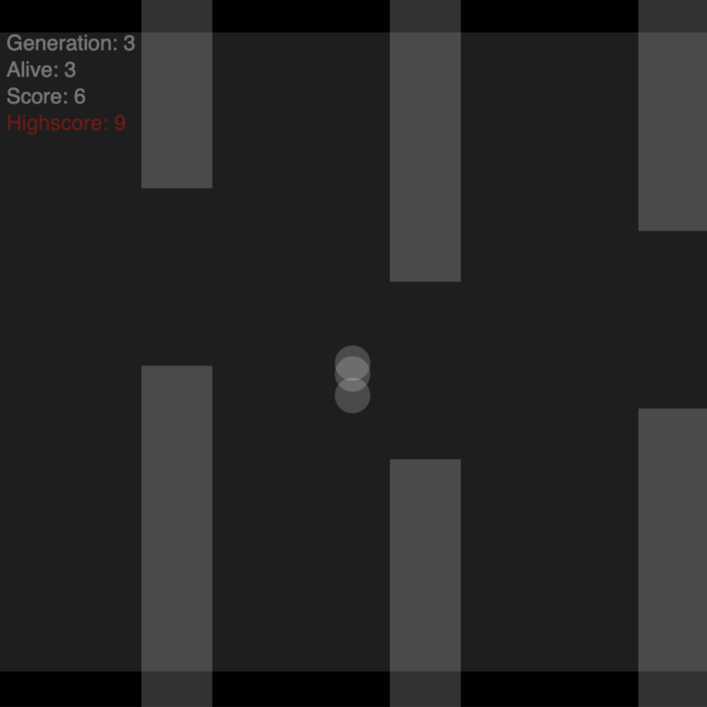

# Genetic Algorithm with Neural Network

This repository contains an implementation of a genetic algorithm to be used to choose the best weights for a neural network. After a few generations, the birds begin to get better at mastering flappy bird. The inputs given are the distances to the next top and bottom bars. The output is whether to jump or not.

The main technique used is NEAT (Neuro Evolution of Augmented Topologies). It is used to evolve the neural network structure itself through the genetic algorithm. The NEAT algorithm is able to create a neural network with the best structure to solve the problem.

Everything done in Javascript from scratch using the P5 library, this includes the neural network implementation. Take a look:

